# targets-spatsoc-networks

A template [`targets`](https://github.com/ropensci/targets) workflow for
generating social networks from GPS data with
[`spatsoc`](https://github.com/ropensci/spatsoc/).

``` mermaid
graph LR
  style Legend fill:#FFFFFF00,stroke:#000000;
  style Graph fill:#FFFFFF00,stroke:#000000;
  subgraph Legend
    xf1522833a4d242c5(["Up to date"]):::uptodate
    xbecb13963f49e50b{{"Object"}}:::none
    xeb2d7cac8a1ce544>"Function"]:::none
    xd03d7c7dd2ddda2b(["Regular target"]):::none
    x6f7e04ea3427f824["Dynamic branches"]:::none
  end
  subgraph Graph
    direction LR
    xfeaff7c1bc5fe2e5{{"group"}}:::uptodate --> x8b0c676d7240242a["gbi<br>get_gbi()"]:::uptodate
    xc25194a2e4c760d5{{"id"}}:::uptodate --> x8b0c676d7240242a["gbi<br>get_gbi()"]:::uptodate
    xdf10c21b92224150["spatgroups<br>group_pts()"]:::uptodate --> x8b0c676d7240242a["gbi<br>get_gbi()"]:::uptodate
    xc389638817199bf0["networks<br>asnipe::get_network()"]:::uptodate --> x2db02d438e6d5e6f["graphs<br>igraph::graph_from_adjacenc..."]:::uptodate
    x7ceaaf778822044f{{"weighted"}}:::uptodate --> x2db02d438e6d5e6f["graphs<br>igraph::graph_from_adjacenc..."]:::uptodate
    x8568773019f89f54{{"mode"}}:::uptodate --> x2db02d438e6d5e6f["graphs<br>igraph::graph_from_adjacenc..."]:::uptodate
    x251c0fecf340765b{{"filepath"}}:::uptodate --> x5d49490da5202c91(["locs<br>fread(filepath)"]):::uptodate
    x544e14c8fac2c5b0["metrics<br>calc_metrics()"]:::uptodate --> x0babe2584c9010e0["merged<br>output"]:::uptodate
    x86be964788bf0a62{{"spatial_threshold"}}:::uptodate --> x0babe2584c9010e0["merged<br>output"]:::uptodate
    xe5f9f129783c9289(["splitsnames<br>unique(filepath) by splitBY"]):::uptodate --> x0babe2584c9010e0["merged<br>output"]:::uptodate
    x7691bca923fa768d{{"temporal_threshold"}}:::uptodate --> x0babe2584c9010e0["merged<br>output"]:::uptodate
    x6f3a445de245bc35>"calc_metrics"]:::uptodate --> x544e14c8fac2c5b0["metrics<br>calc_metrics()"]:::uptodate
    x2db02d438e6d5e6f["graphs<br>igraph::graph_from_adjacenc..."]:::uptodate --> x544e14c8fac2c5b0["metrics<br>calc_metrics()"]:::uptodate
    xc46e1ab6af5c8492{{"associationindex"}}:::uptodate --> xc389638817199bf0["networks<br>asnipe::get_network()"]:::uptodate
    x8b0c676d7240242a["gbi<br>get_gbi()"]:::uptodate --> xc389638817199bf0["networks<br>asnipe::get_network()"]:::uptodate
    xd135a9eb46727432>"prep_dates"]:::uptodate --> x3906e3b7b61cde90(["prep<br>prep_dates(locs, datetime)"]):::uptodate
    xe1070fbd6d46a47b{{"datetime"}}:::uptodate --> x3906e3b7b61cde90(["prep<br>prep_dates(locs, datetime)"]):::uptodate
    x5d49490da5202c91(["locs<br>fread(filepath)"]):::uptodate --> x3906e3b7b61cde90(["prep<br>prep_dates(locs, datetime)"]):::uptodate
    xbd740468b493bf05{{"coords"}}:::uptodate --> xdf10c21b92224150["spatgroups<br>group_pts()"]:::uptodate
    xc25194a2e4c760d5{{"id"}}:::uptodate --> xdf10c21b92224150["spatgroups<br>group_pts()"]:::uptodate
    x86be964788bf0a62{{"spatial_threshold"}}:::uptodate --> xdf10c21b92224150["spatgroups<br>group_pts()"]:::uptodate
    xc119b121c4bf638e["timegroups<br><pre>group_times()</pre>"]:::uptodate --> xdf10c21b92224150["spatgroups<br>group_pts()"]:::uptodate
    x6fa178f2283ab5b1{{"splitBy"}}:::uptodate --> xf94084fe2fb21595(["splits<br>tar_group by splitBy"]):::uptodate
    x3906e3b7b61cde90(["prep<br>prep_dates(locs, datetime)"]):::uptodate --> xf94084fe2fb21595(["splits<br>tar_group by splitBy"]):::uptodate
    x251c0fecf340765b{{"filepath"}}:::uptodate --> xe5f9f129783c9289(["splitsnames<br>unique(filepath) by splitBY"]):::uptodate
    x6fa178f2283ab5b1{{"splitBy"}}:::uptodate --> xe5f9f129783c9289(["splitsnames<br>unique(filepath) by splitBY"]):::uptodate
    x3906e3b7b61cde90(["prep<br>prep_dates(locs, datetime)"]):::uptodate --> xe5f9f129783c9289(["splitsnames<br>unique(filepath) by splitBY"]):::uptodate
    xe1070fbd6d46a47b{{"datetime"}}:::uptodate --> xc119b121c4bf638e["timegroups<br><pre>group_times()</pre>"]:::uptodate
    x7691bca923fa768d{{"temporal_threshold"}}:::uptodate --> xc119b121c4bf638e["timegroups<br><pre>group_times()</pre>"]:::uptodate
    xf94084fe2fb21595(["splits<br>tar_group by splitBy"]):::uptodate --> xc119b121c4bf638e["timegroups<br><pre>group_times()</pre>"]:::uptodate
    
  end
  classDef uptodate stroke:#000000,color:#ffffff,fill:#354823;
  classDef none stroke:#000000,color:#000000,fill:#94a4ac;
```

## Usage

1.  Clone/fork/download/etc make your own copy somewhere!
2.  Add your data to the input folder (and remove the example data)
3.  Open `_targets.R`
4.  Change the global variables in the Variables section
5.  Set your output (see below)
6.  Run `targets::tar_make()`

As for output, right now it’s set up with four different options after
the Targets section

1.  One data set, simply set the path
2.  Multiple data sets, provide the list or wildcard of paths
3.  Multiple data sets, and matching thresholds or other variables( eg.
    one data set with 50m spatial threshold and another with 100m).
4.  Multiple data sets, crossed with multiple thresholds (or other
    variables). This could be used for a sensitivity analysis.

To select your output format, comment out or delete the other options.
{targets} looks for the last declared target in the `_targets.R` file.

## Resources

- {spatsoc}
  - <https://docs.ropensci.org/spatsoc/>
  - <https://docs.ropensci.org/spatsoc/articles/using-in-sna.html>
- {targets}
  - <https://docs.ropensci.org/targets>
  - <https://books.ropensci.org/targets>
